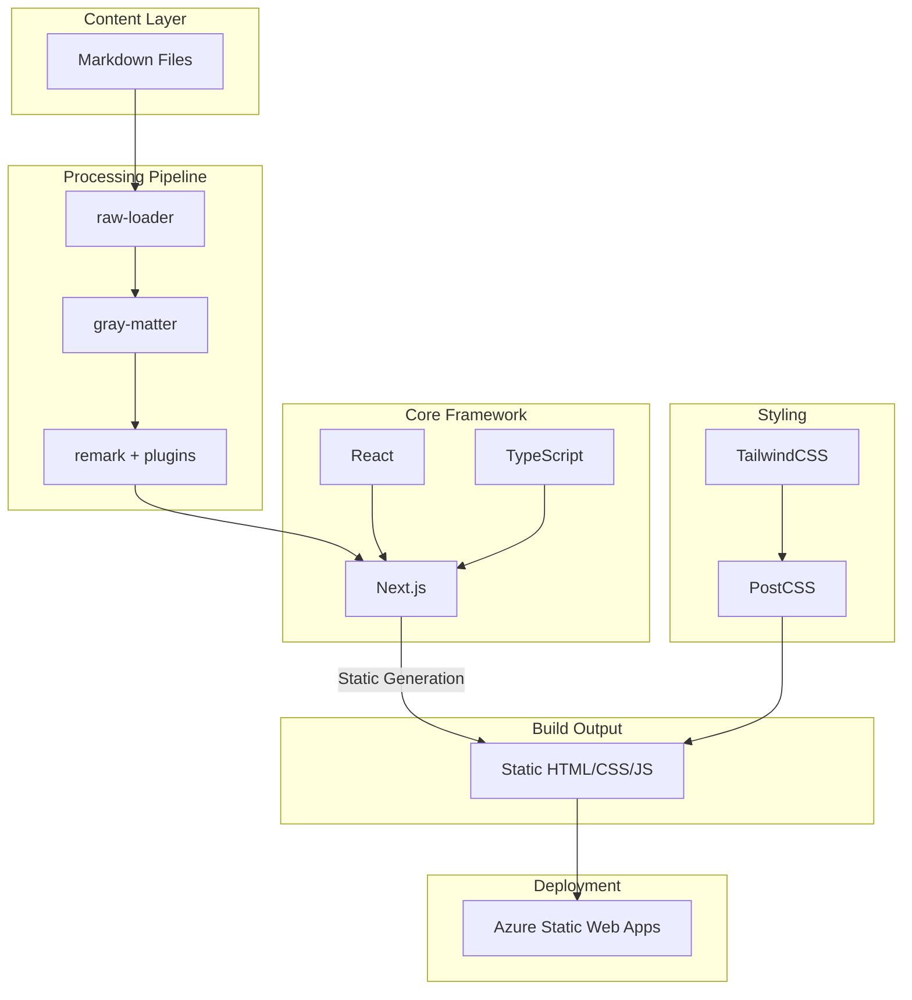

```mermaid
graph TB
    subgraph "Content Layer"
        MD[Markdown Files]
    end

    subgraph "Processing Pipeline"
        RAW[raw-loader]
        GRAY[gray-matter]
        REMARK[remark + plugins]
    end

    subgraph "Core Framework"
        NEXT[Next.js]
        REACT[React]
        TS[TypeScript]
    end

    subgraph "Styling"
        TAILWIND[TailwindCSS]
        POSTCSS[PostCSS]
    end

    subgraph "Build Output"
        STATIC[Static HTML/CSS/JS]
    end

    subgraph "Deployment"
        AZURE[Azure Static Web Apps]
    end

    MD --> RAW
    RAW --> GRAY
    GRAY --> REMARK
    REMARK --> NEXT

    NEXT --> |Static Generation| STATIC
    REACT --> NEXT
    TS --> NEXT
    TAILWIND --> POSTCSS
    POSTCSS --> STATIC

    STATIC --> AZURE
```
