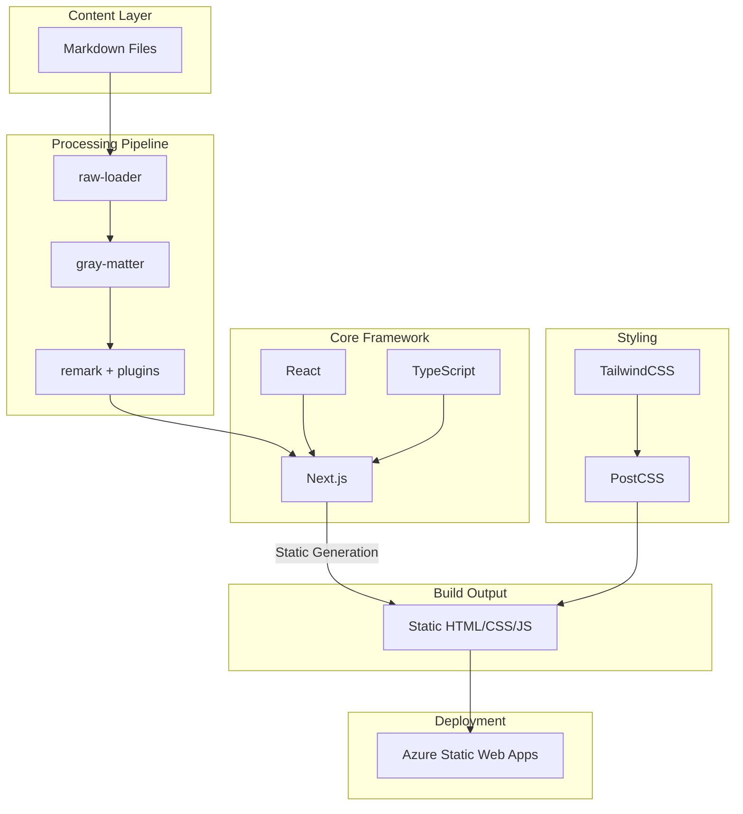

---
# Core Metadata
title: "Understanding My Website Architecture"
date: "2025-04-04"
lastModified: "2025-04-04"
author: "Daniel Fullerton"
language: "en"
status: "published"

# SEO & Social
description: "A deep dive into the technical architecture of danielfullerton.com, exploring how Next.js, React, TypeScript, and various tools work together to create a fast, maintainable static website."
excerpt: "Explore how Next.js, React, TypeScript, and modern tooling come together to power this static website, from Markdown processing to deployment."
keywords:
  [
    "website architecture",
    "Next.js",
    "React",
    "TypeScript",
    "static site generation",
    "markdown processing",
    "TailwindCSS",
    "Azure Static Web Apps",
    "technical stack",
    "web development",
  ]
canonicalUrl: "/blog/Understanding%20My%20Website%20Architecture"
noindex: false
nofollow: false

# Visual Assets
image: "/understanding-website-architecture.png"
coverImage: "/architecture.jpg"
openGraphImage: "/df.png"

# Content Organization
category: "Technical"
tags: ["architecture", "web-development", "next.js", "react", "static-site"]
series: Pet Projects
featured: true
timeToRead: "8 minutes"

# Enhanced Navigation
tableOfContents: true
---

After recently updating my website's architecture, I thought it would be interesting to share how everything fits together. Let's dive into the technical stack and explore how different components work together to create this fast, maintainable static website.

## High-Level Architecture

Here's a visual representation of how the different components interact:



## Core Framework

The website is built on a robust foundation of modern web technologies:

### Next.js

At the heart of the architecture is Next.js 15.2.4, configured for static site generation (SSG). This means that all pages are pre-rendered at build time, resulting in excellent performance and SEO benefits. The static export configuration (`output: "export"`) ensures that the final build can be deployed to any static hosting platform.

### React & TypeScript

The UI is built with React 19.0.0, providing a component-based architecture that makes the codebase maintainable and scalable. TypeScript adds a layer of type safety, catching potential errors before they reach production and making the code more self-documenting.

## Content Processing Pipeline

One of the most interesting aspects of the architecture is how content (like this blog post) flows through the system:

1. **Raw Content**: Blog posts are written in Markdown files, stored in the `/posts` directory.
2. **Processing Steps**:
   - `raw-loader` reads the Markdown files as raw content
   - `gray-matter` parses the frontmatter metadata (the YAML-like section at the top of each post)
   - `remark` and its plugins transform the Markdown into HTML, with support for GitHub-flavored Markdown

This pipeline makes content management straightforward - I can write posts in Markdown with rich metadata, and the build process handles all the conversion and optimization automatically.

## Styling System

The styling architecture is built around TailwindCSS 3.4.1, which provides:

- Utility-first CSS approach for rapid development
- Built-in responsive design utilities
- Automatic purging of unused styles in production
- Typography plugin for beautiful Markdown content rendering

PostCSS processes the CSS with features like:

- Autoprefixer for cross-browser compatibility
- CSS nesting and modern features
- Optimization and minification for production

## Build & Deployment

The build process is streamlined and efficient:

1. **Development**:

   ```bash
   next dev -H 0.0.0.0
   ```

   Provides hot-reloading and fast feedback during development.

2. **Production Build**:

   ```bash
   next build
   ```

   Generates optimized static files, including:

   - Pre-rendered HTML for all pages
   - Minified JavaScript bundles
   - Optimized CSS with only used styles
   - Static assets in the public directory

3. **Deployment**:
   The site is hosted on Azure Static Web Apps, which provides:
   - Global CDN distribution
   - Automatic HTTPS
   - CI/CD integration
   - Custom domain support

## Benefits of This Architecture

This architecture provides several key benefits:

### Performance

- Static pre-rendering means fast initial page loads
- No server-side rendering latency
- Efficient asset optimization
- Global CDN distribution

### Developer Experience

- TypeScript for type safety
- Hot reloading during development
- Component-based architecture
- Simple content management with Markdown

### Maintainability

- Clear separation of concerns
- Strong typing with TypeScript
- Modular component structure
- Simple content updates via Markdown

### SEO & Accessibility

- Static HTML generation
- Built-in metadata management
- Semantic markup through Markdown
- Fast loading times

## Looking Forward

While this architecture serves its purpose well, there's always room for improvement. Some areas I'm considering for future enhancements:

- Image optimization pipeline
- Enhanced markdown features
- Automated testing infrastructure
- Performance monitoring
- Analytics integration

This architecture has proven to be robust and maintainable, providing a solid foundation for both current needs and future growth. The combination of modern tools and static generation creates a fast, reliable experience for visitors while maintaining a clean, efficient development workflow.
